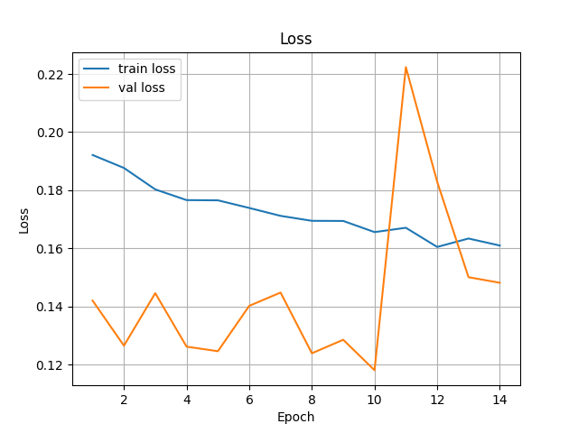
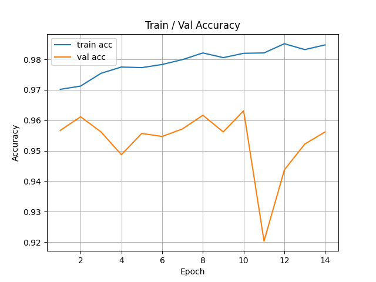
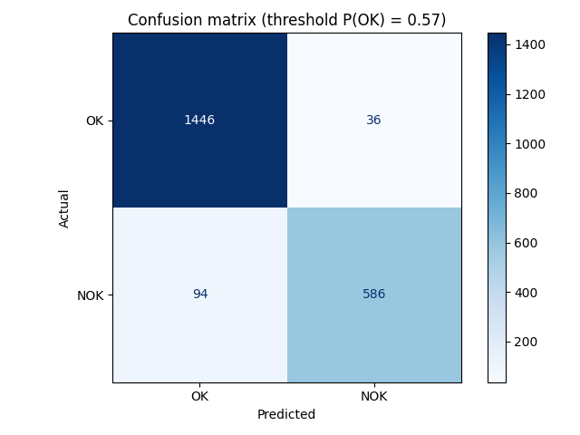
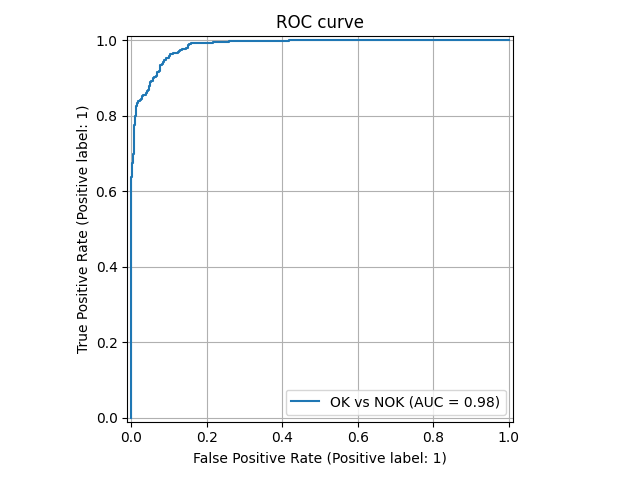
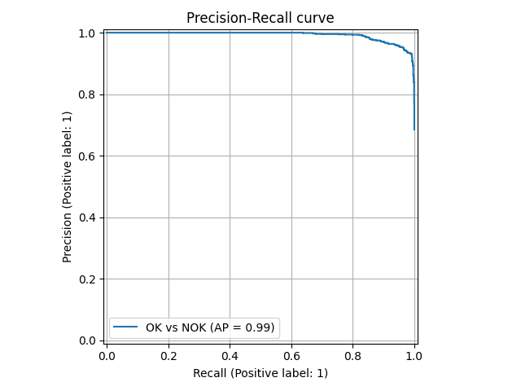
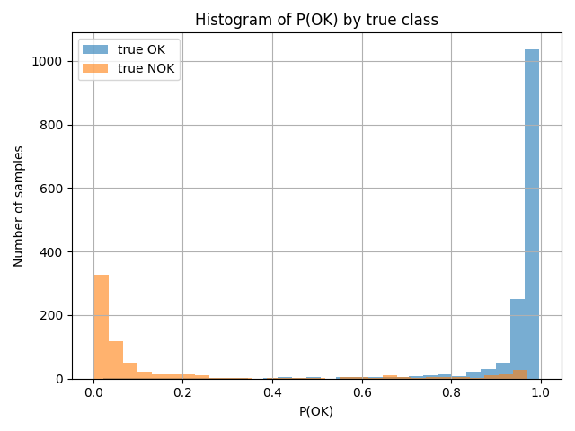

# OK/NOK Image Classifier (PyTorch)

Binary image classification pipeline: **OK** vs **NOK** (defective part detection).

The pipeline covers the full workflow: dataset splitting, offline augmentation,
model training, validation, test evaluation, single-image prediction with Grad-CAM
visualization, and batch prediction with CSV output.

---

## Requirements

Install from `requirements.txt`:

```bash
pip install -r requirements.txt
```

Key packages: `torch==2.10.0`, `torchvision==0.25.0`, `scikit-learn`,
`opencv-python`, `matplotlib`, `grad-cam`, `tqdm`.

---

## Project structure

```
.
├── ML/
│   ├── Config.py                # training CFG + CNN model definition
│   ├── ML_objects.py            # Loader + Trainer (training pipeline)
│   ├── ML_val.py                # validation evaluator
│   ├── ML_test.py               # test evaluator
│   ├── TestConfig.py            # EvalCFG (checkpoint path, threshold)
│   ├── Predict_objects.py       # single-image inference + Grad-CAM
│   ├── Predict_many_objects.py  # batch inference → CSV
│   ├── best3.pt                 # previous checkpoint
│   ├── best4.pt                 # current best checkpoint
│   └── best_ft.pt               # older fine-tuned checkpoint
├── Augment/
│   ├── AugmentConfig.py         # augmentation config + operations
│   └── main.py                  # runs offline augmentation
├── Split/
│   └── split.py                 # group-aware dataset splitter
├── results_best4/               # training + evaluation metrics for best4.pt
│   ├── Loss.png
│   ├── Train_Val_Acc.png
│   ├── ROC_curve.png
│   ├── Precision_Recall.png
│   ├── histogram.png
│   ├── matrix.png
│   └── validation/
│       ├── ROC.png
│       ├── Precision-Recall.png
│       ├── Threshold.png
│       ├── histogram.png
│       └── matrix.png
├── data/                        # NOT included in repo (confidential)
├── results/                     # NOT included in repo (generated locally)
├── requirements.txt
└── README.md
```

> `data/` is excluded from this repository — it contains confidential image data.
> `results/` is also excluded — it is generated locally by running the scripts.
> `results_best4/` is included in the repository.

All scripts within a folder use relative imports and must be run
from their respective subdirectory (e.g. `cd ML && python ML_objects.py`).

---

## Dataset

> The `data/` directory is not included in this repository. To use the pipeline,
> prepare your own dataset and configure paths in the relevant config files (see
> [Configuration / Paths](#configuration--paths)).

### Folder format

`torchvision.datasets.ImageFolder` is used, so images must be organized as:

```
data/Split/
  train/
    OK/
    NOK/
  val/
    OK/
    NOK/
  test/
    OK/
    NOK/
```

### Splitting

`Split/split.py` builds train/val/test splits with **group-aware shuffling**
to prevent leakage between original NOK images and their augmented variants:

- OK images: each file is its own group.
- NOK images: group id = filename prefix before the first `_`
  (original and all augmented variants share a group and always land in the same split).

Default split ratios:

| Set   | Ratio |
|-------|-------|
| train | 70%   |
| val   | 15%   |
| test  | 15%   |

The split produces a `manifest.csv` with `path`, `label_name`, `label_idx`,
`group_id` and `split` columns for every image.

```bash
cd Split
python split.py
```

---

## Configuration / Paths

Each module has a `CFG` (or `EvalCFG`) dataclass at the top of its file.
Set the paths there before running.

### Training (`ML/Config.py`)

| Field       | Default              | Description                              |
|-------------|----------------------|------------------------------------------|
| `TRAIN_DIR` | `data/Split/train`   | Training images (OK/ + NOK/ subfolders)  |
| `VAL_DIR`   | `data/Split/val`     | Validation images                        |
| `TEST_DIR`  | `data/Split/test`    | Test images                              |
| `CKPT_PATH` | `ML/best3.pt`        | Checkpoint to load at training start     |
| `SAVE_CKPT` | `ML/best4.pt`        | Where to save the best checkpoint        |

### Evaluation (`ML/TestConfig.py`)

| Field        | Default       | Description                          |
|--------------|---------------|--------------------------------------|
| `CKPT_PATH`  | `ML/best4.pt` | Checkpoint loaded for val/test eval  |
| `THRESH_OK`  | `0.57`        | Decision threshold P(OK)             |
| `PLOT_CURVES`| `True`        | Whether to show ROC/PR/histogram plots|

### Single-image inference (`ML/Predict_objects.py`)

| Field       | Default       | Description                       |
|-------------|---------------|-----------------------------------|
| `CKPT_PATH` | `ML/best3.pt` | Checkpoint for inference          |
| `THRESH_OK` | `0.57`        | Decision threshold P(OK)          |
| `TTA_VIEWS` | `6`           | Number of TTA views               |

> To use **best4.pt** (current best), change `CKPT_PATH` in the CFG dataclass.

### Batch inference (`ML/Predict_many_objects.py`)

| Field            | Default                   | Description                              |
|------------------|---------------------------|------------------------------------------|
| `CKPT_PATH`      | `ML/best4.pt`             | Checkpoint for inference                 |
| `IMG_DIR`        | `data/Split/val/NOK`      | Directory with images to predict         |
| `CSV_PATH`       | `results/predictions.csv` | Output CSV file path                     |
| `THRESH_OK`      | `0.57`                    | Decision threshold P(OK)                 |
| `TTA_VIEWS`      | `6`                       | Number of TTA views                      |
| `EXPECTED_LABEL` | `"NOK"`                   | Ground-truth label for the whole batch (`"OK"`, `"NOK"`, or `"N/A"`) |

### Dataset splitting (`Split/split.py`)

| Field          | Default                  | Description                         |
|----------------|--------------------------|-------------------------------------|
| `OK_DIR`       | `data/input_data/ok`     | Source OK images                    |
| `NOK_ORIG_DIR` | `data/input_data/nok`    | Source NOK originals                |
| `NOK_AUG_DIR`  | `data/nok_augmented`     | Augmented NOK images                |
| `OUT_ROOT`     | `data/Split`             | Output root for train/val/test      |

### Offline augmentation (`Augment/AugmentConfig.py`)

| Field        | Default               | Description                   |
|--------------|-----------------------|-------------------------------|
| `SRC_DIR`    | `data/input_data/nok` | Source NOK images             |
| `DEST_DIR`   | `data/nok_augmented`  | Output for augmented images   |
| `GOOD_COUNT` | `9809`                | Target total NOK count        |

---

## Model

Defined in `ML/Config.py`. Takes a **128×128 RGB** image and outputs a single logit.

### Architecture

| Layer | Type                      | Channels | Kernel | Stride | Dilation |
|-------|---------------------------|----------|--------|--------|----------|
| conv1 | Conv2d + BatchNorm + ReLU | 3 → 16   | 5×5    | 2      | 1        |
| conv2 | Conv2d + BatchNorm + ReLU | 16 → 32  | 3×3    | 2      | 1        |
| conv3 | Conv2d + BatchNorm + ReLU | 32 → 64  | 3×3    | 2      | 1        |
| conv4 | Conv2d + BatchNorm + ReLU | 64 → 64  | 3×3    | 1      | **2**    |
| GAP   | AdaptiveAvgPool2d(1×1)    | 64 → 64  | —      | —      | —        |
| fc1   | Linear + Dropout(0.5)     | 64 → 64  | —      | —      | —        |
| fc2   | Linear                    | 64 → 1   | —      | —      | —        |

`conv4` uses **dilation=2** to widen the receptive field without extra parameters.

### Decision rule

```
P(OK) = sigmoid(logit)
label = "OK"  if P(OK) >= THRESH_OK
        "NOK" otherwise
```

Default `THRESH_OK = 0.57` (tuned on the validation set; original default was 0.65).

---

## Offline augmentation

Run before splitting the dataset to generate additional NOK images from originals.

```bash
cd Augment
python main.py
```

Each operation saves a new file with a tag suffix. Available operations (~30 variants per image):

- **Rotations:** `rot+3`, `rot-3` (reflected borders)
- **Shifts + zoom:** `shift_left`, `shift_right`, `shift_up`, `shift_down` (×0.90),
  `shift_big_left`, `shift_big_right` (×0.88), `zoom_center_0.90`, `zoom_center_0.80`
- **Crops:** `crop_top`, `crop_bottom` (×0.85), `crop_left`, `crop_right` (×0.82),
  `crop_top_strong`, `crop_bottom_strong` (×0.75)
- **Brightness:** `bright+10`, `bright-10`, `bright+5`, `bright-5`
- **Contrast:** `contrast+10`, `contrast-10`
- **Noise — global:** `bg+07`, `bg+12`
- **Noise — edge strip:** `bgp+08`, `bgp+15`
- **Flip:** `hflip`
- **Blur:** `blur`
- **Combos:** `hflip_rot+3`, `hflip_rot-3`

---

## Training

```bash
cd ML
python ML_objects.py
```

### Hyperparameters

| Parameter      | Value                                                    |
|----------------|----------------------------------------------------------|
| Input size     | 128×128                                                  |
| Batch size     | 64                                                       |
| Optimizer      | Adam — lr=1e-4, weight_decay=7e-4                       |
| LR scheduler   | ReduceLROnPlateau — factor=0.5, patience=5, min_lr=3e-6 |
| Max epochs     | 20                                                       |
| Early stopping | patience=5 (monitors val loss)                          |
| Loss           | BCEWithLogitsLoss + label smoothing ε=0.05              |
| Grad clipping  | max_norm=1.0                                             |
| Class balance  | WeightedRandomSampler                                    |

The best checkpoint (lowest val loss) is saved to `SAVE_CKPT` from `ML/Config.py`.

### Training transforms

Applied to the training set only:

| Transform            | Parameters                                                                       |
|----------------------|----------------------------------------------------------------------------------|
| RandomResizedCrop    | 128×128, scale=(0.92, 1.0), ratio=(0.98, 1.02)                                  |
| RandomHorizontalFlip | p=0.5                                                                            |
| RandomAffine         | degrees=3, translate=(0.02, 0.02), scale=(0.98, 1.02)                           |
| ColorJitter          | brightness=0.05, contrast=0.05                                                  |
| GaussianBlur         | kernel=3, sigma=(0.1, 1.0)                                                      |
| ToTensor             | —                                                                                |
| PerimeterErasing     | p=0.15, band=0.12 — custom: zeros a rectangular strip along one random edge     |
| Normalize            | mean=(0.5, 0.5, 0.5), std=(0.5, 0.5, 0.5)                                      |

### Validation / test transforms

| Transform  | Parameters                                 |
|------------|--------------------------------------------|
| Resize     | 128×128                                    |
| CenterCrop | 128                                        |
| ToTensor   | —                                          |
| Normalize  | mean=(0.5, 0.5, 0.5), std=(0.5, 0.5, 0.5) |

---

## Evaluation

### Validation

```bash
cd ML
python ML_val.py
```

Loads the checkpoint from `ML/TestConfig.py → EvalCFG.CKPT_PATH` (default: `ML/best4.pt`).
Computes accuracy, balanced accuracy, precision, recall, F1, ROC AUC, PR AUC,
MCC, Cohen's κ, log loss, and Brier score. Also reports per-class error rates
(NOK→OK rate, OK→NOK rate).

Plots: confusion matrix, ROC curve, PR curve, score histogram, threshold-tuning curve.

### Test

```bash
cd ML
python ML_test.py
```

Same metrics on the test set using the fixed threshold from `EvalCFG.THRESH_OK`.
Plots: confusion matrix, ROC curve, PR curve.

---

## Inference

### Single-image prediction (`Predict_objects.py`)

`ML/Predict_objects.py` provides two modes: **Grad-CAM visualization** and
**TTA-based prediction**. Both load the checkpoint from `CFG.CKPT_PATH`
(default: `ML/best3.pt`; change to `ML/best4.pt` to use the current best).

#### Grad-CAM (default `__main__`)

```bash
cd ML
python Predict_objects.py
```

A file dialog opens. After selecting an image:

- the model runs inference
- a matplotlib window displays the Grad-CAM heatmap overlaid on the image
  and the raw activation map (jet colormap: 0 = ignored → 1 = decisive)
- the decision, P(OK) and P(NOK) are printed to the console

#### Simple TTA prediction (PredictPhoto)

**Option A — from Python:**

```python
from Predict_objects import CFG, PredictPhoto
from ML_objects import CNN

cfg = CFG()
model = CNN()
PredictPhoto(cfg, model).predict_one()
```

**Option B — replace the `__main__` block in `Predict_objects.py`:**

```python
if __name__ == "__main__":
    cfg = CFG()
    model = CNN()
    PredictPhoto(cfg, model).predict_one()
```

A file dialog opens, the model runs TTA inference, and the result is printed:

```
=== result ===
Decision : OK  @thr_OK=0.57
P(OK)    : 0.8431  (base=0.8102)
P(NOK)   : 0.1569  (base=0.1898)
```

`P(OK)` is the TTA median; `base` is the value for the unmodified image.

#### Test-time augmentation (TTA)

`PredictPhoto` evaluates **6 views** per image and reports the **median P(OK)**:

| View       | Description                        |
|------------|------------------------------------|
| original   | unmodified image                   |
| hflip      | horizontal flip                    |
| rot +3°    | rotation +3°                       |
| rot −3°    | rotation −3°                       |
| micro-blur | resize +2px then back to 128×128   |
| crop       | 2% border removed on each side     |

The number of views is controlled by `CFG.TTA_VIEWS` (default: 6).

---

### Batch prediction (`Predict_many_objects.py`)

Runs TTA inference on all images in a directory and saves results to CSV.

```bash
cd ML
python Predict_many_objects.py
```

Configure paths and expected label in `CFG` at the top of the file before running.
To evaluate a directory where all images share the same ground-truth label, set `EXPECTED_LABEL`:

```python
cfg = CFG(
    IMG_DIR=Path("data/Split/val/NOK"),
    EXPECTED_LABEL="NOK",   # or "OK"; set "N/A" to disable the correct column
)
```

#### Output CSV structure

Saved to `CFG.CSV_PATH` (default: `results/predictions.csv`).

| Column       | Type    | Description                                                     |
|--------------|---------|-----------------------------------------------------------------|
| `filename`   | str     | Image filename (basename)                                       |
| `path`       | str     | Full path to the image                                          |
| `expected`   | str     | Ground-truth label from `EXPECTED_LABEL` (`"OK"`, `"NOK"`, `"N/A"`) |
| `p_ok`       | float   | TTA median P(OK) — probability the image is OK                 |
| `p_nok`      | float   | `1 − p_ok`                                                      |
| `thresh_ok`  | float   | Decision threshold used                                         |
| `decision`   | str     | Model decision: `"OK"` if `p_ok >= thresh_ok`, else `"NOK"`    |
| `correct`    | bool/str| `True`/`False` if expected is set; `"N/A"` otherwise           |

Example row:

```
10260.jpg,data/Split/val/NOK/10260.jpg,NOK,0.8907,0.1093,0.57,OK,False
```

---

## Results (best4.pt)

> `results_best4/` is included in the repository.

### Training history

| File                               | Content                        |
|------------------------------------|--------------------------------|
| `results_best4/Loss.png`           | Train / val loss per epoch     |
| `results_best4/Train_Val_Acc.png`  | Train / val accuracy per epoch |




### Evaluation — test set

| File                                 | Content                           |
|--------------------------------------|-----------------------------------|
| `results_best4/matrix.png`           | Confusion matrix                  |
| `results_best4/ROC_curve.png`        | ROC curve (AUC)                   |
| `results_best4/Precision_Recall.png` | Precision-Recall curve            |
| `results_best4/histogram.png`        | P(OK) score distribution by class |






### Evaluation — validation set

| File                                          | Content                                           |
|-----------------------------------------------|---------------------------------------------------|
| `results_best4/validation/matrix.png`         | Confusion matrix                                  |
| `results_best4/validation/ROC.png`            | ROC curve                                         |
| `results_best4/validation/Precision-Recall.png` | Precision-Recall curve                          |
| `results_best4/validation/Threshold.png`      | Threshold tuning (F1/precision/recall vs threshold) |
| `results_best4/validation/histogram.png`      | P(OK) score distribution by class                |

---

## Notes

- All paths in config files are relative and resolved from the working directory
  where the script is executed (typically the script's own subdirectory, e.g. `ML/`).
  Adjust paths to match your local folder layout.
- Scripts use local imports and must be run from their own subdirectory
  (`ML/`, `Augment/`, `Split/`).
- **Current best checkpoint:** `ML/best4.pt` — used by `ML_test.py`, `ML_val.py`,
  and `Predict_many_objects.py`. `Predict_objects.py` defaults to `best3.pt`;
  update `CFG.CKPT_PATH` to switch.
- Grad-CAM requires the `grad-cam` package (included in `requirements.txt`).
